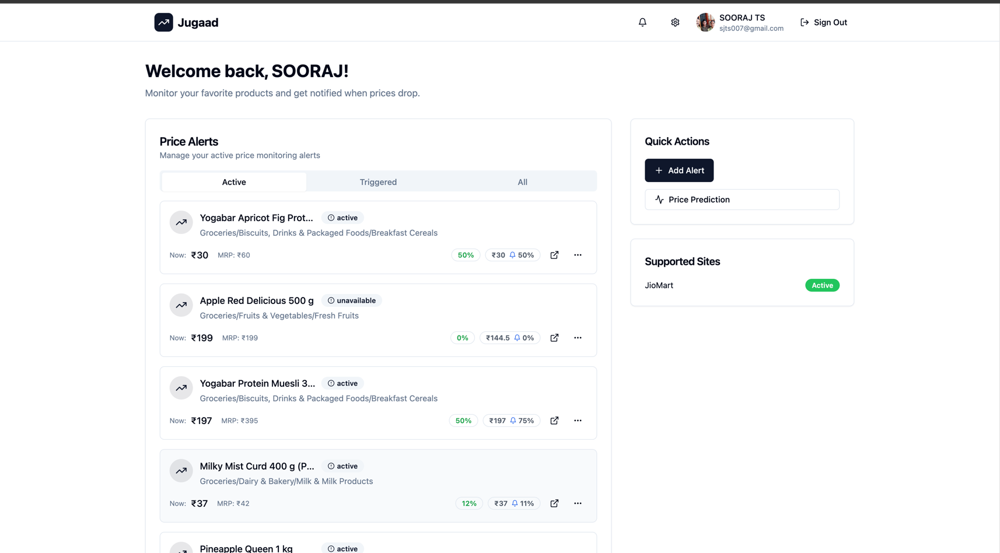
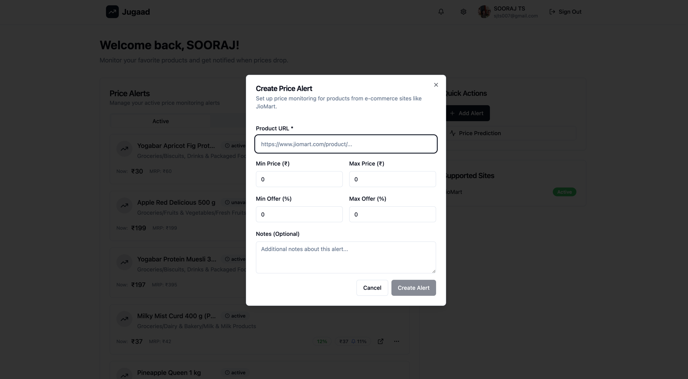
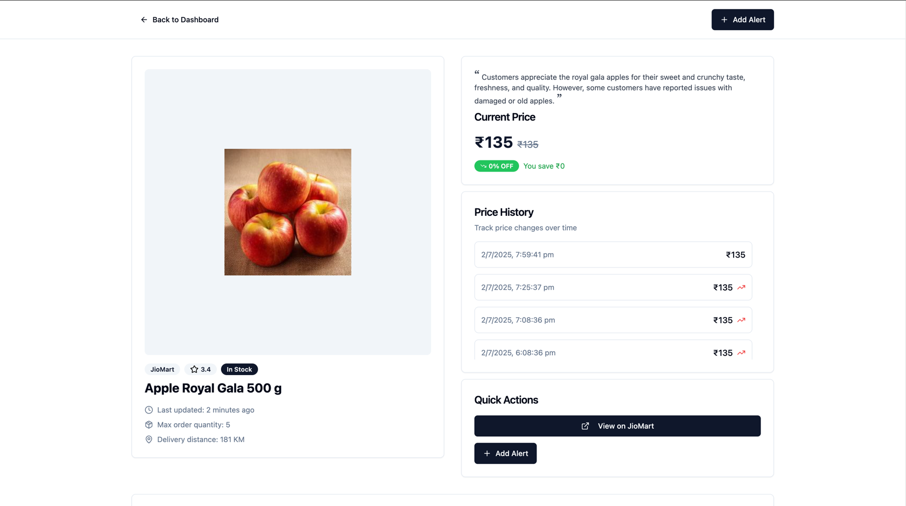
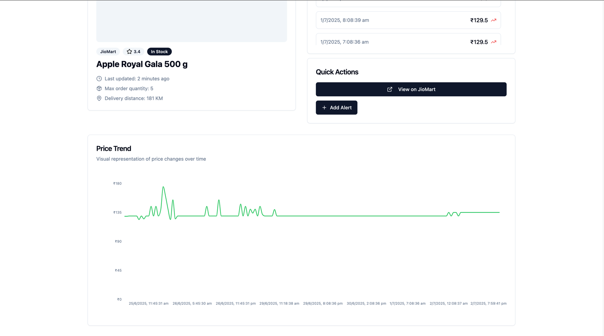

<p align="center">
  
</p>

<h1 align="center">Jugaad - JioMart Price Tracker</h1>

A lightweight and modern web application that allows users to **track product prices on JioMart** and get real-time updates. Built for speed and aesthetics using **Vite**, **React**, **TailwindCSS**, and **shadcn/ui** components.

---

## 🚀 Features

- 🔍 Search and monitor products from JioMart
- 📉 Track historical price trends
- 🔔 Get notified on price drops (WIP)
- 💡 Clean and responsive UI using **shadcn/ui**
- ⚡ Blazing fast performance with **Vite**

---

## 🧑‍💻 Tech Stack

- **Frontend**: [React](https://reactjs.org/)
- **Build Tool**: [Vite](https://vitejs.dev/)
- **Styling**: [TailwindCSS](https://tailwindcss.com/)
- **UI Components**: [shadcn/ui](https://ui.shadcn.dev/)

---


## 📁 Project Structure

```
jiomart-price-tracker/
├── dist/                       # Build output (ignored in Git)
├── examples/                   # Screenshots for documentation
├── node_modules/               # Dependencies
├── public/                     # Static assets
├── src/                        # Main application source code
│   ├── components/             # Reusable UI components
│   ├── hooks/                  # Custom React hooks
│   ├── lib/                    # Utilities, constants, types, etc.
│   ├── pages/                  # Route-level React components
│   ├── services/               # API clients or external integrations
│   ├── utils/                  # Helper functions/utilities
│   ├── App.tsx                 # Root app component
│   ├── main.tsx                # Vite entry point
│   └── index.css               # Global styles
├── .env                        # Environment variables
├── index.html                  # HTML entry point for Vite
├── README.md                   # Project documentation
├── package.json                # Project metadata and scripts
├── tailwind.config.ts          # TailwindCSS configuration
├── vite.config.ts              # Vite configuration
├── vercel.json                 # Vercel deployment configuration
```


## 📦 Installation

```bash
git clone https://github.com/SOORAJTS2001/jugaad-frontend .
npm install
npm run dev
```

## 🖼️ UI Snapshots

### 🔹 Landing & Listing Pages
<table>
  <tr>
    <td align="center"><b>Landing Page</b></td>
    <td align="center"><b>Listing Page</b></td>
    <td align="center"><b>Alert Page</b></td>
  </tr>
  <tr>
    <td></td>
    <td></td>
    <td></td>
  </tr>
</table>

### 🔹 Detail Page
<table>
  <tr>
    <td align="center"><b>Detail Page</b></td>
    <td align="center"><b>Graph View</b></td>
  </tr>
  <tr>
    <td></td>
    <td></td>
  </tr>
</table>

